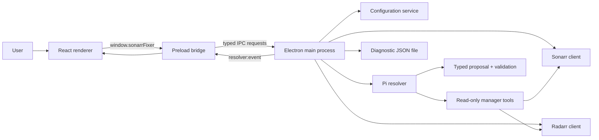
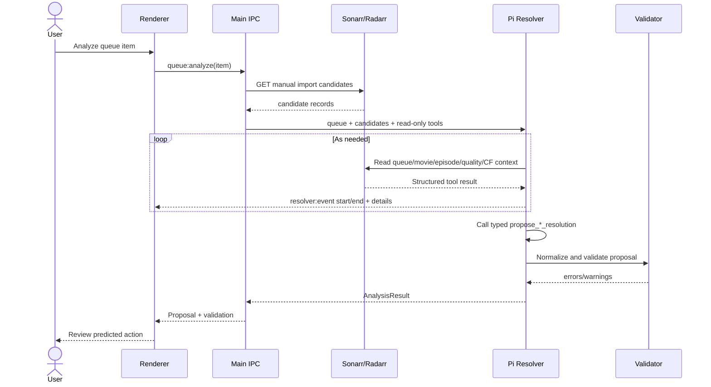

# Architecture

## Overview

Arr Fixer is a local Electron application with a React renderer and a Node.js main process. The main
process owns configuration, credentials, manager HTTP clients, Pi sessions, filesystem writes, and
all external side effects. The renderer owns user interaction and transient review state.

## Electron process boundaries

### Renderer

The renderer entry point is [`src/renderer/src/App.tsx`](../src/renderer/src/App.tsx). It manages:

- the active queue and selected item;
- loaded candidates and per-item analysis results;
- Dry Run and auto-apply state;
- review history and diagnostic events;
- the full-screen configuration surface;
- confirmations, toasts, and queue refresh scheduling.

The renderer has no Node.js integration. It cannot read `.env`, open arbitrary local files, or call
Sonarr/Radarr directly.

### Preload bridge

[`src/preload/index.ts`](../src/preload/index.ts) exposes a narrow `window.sonarrFixer` API through
Electron's `contextBridge`. It translates renderer calls into named IPC requests and forwards
`resolver:event` messages back to the renderer.

`contextIsolation` is enabled and `nodeIntegration` is disabled. The BrowserWindow currently uses
`sandbox: false`, so the preload bridge and IPC surface remain important security boundaries.

### Main process

[`src/main/index.ts`](../src/main/index.ts) creates the BrowserWindow and registers IPC handlers from
[`src/main/ipc.ts`](../src/main/ipc.ts). The main process:

- loads and saves local configuration;
- chooses the active Sonarr or Radarr client;
- tests manager connections;
- fetches queue and manual-import data;
- creates and cancels Pi analysis sessions;
- applies validated imports and removes queue items;
- emits structured diagnostic events;
- writes redacted diagnostic exports.

## Component map

| Component | Source | Responsibility |
| --- | --- | --- |
| Main bootstrap | [`src/main/index.ts`](../src/main/index.ts) | Window creation, renderer loading, external-link handling |
| IPC controller | [`src/main/ipc.ts`](../src/main/ipc.ts) | Main-process application API and event emission |
| Shared contracts | [`src/shared/types.ts`](../src/shared/types.ts) | IPC payloads, normalized queue/candidate/proposal types |
| Configuration | [`src/main/services/config.ts`](../src/main/services/config.ts) | Defaults, precedence, normalization, `.env` persistence |
| Sonarr adapter | [`src/main/services/sonarr-client.ts`](../src/main/services/sonarr-client.ts) | Sonarr API v3 reads and mutations |
| Radarr adapter | [`src/main/services/radarr-client.ts`](../src/main/services/radarr-client.ts) | Radarr API v3 reads and mutations |
| Pi resolver | [`src/main/services/pi-resolver.ts`](../src/main/services/pi-resolver.ts) | Session setup, prompts, tool execution, proposal capture |
| Sonarr tools | [`src/main/services/pi-sonarr-tools.ts`](../src/main/services/pi-sonarr-tools.ts) | Read-only Sonarr lookup tools |
| Radarr tools | [`src/main/services/pi-radarr-tools.ts`](../src/main/services/pi-radarr-tools.ts) | Read-only Radarr lookup tools |
| Proposal tool | [`src/main/services/pi-proposal-tool.ts`](../src/main/services/pi-proposal-tool.ts) | Typed terminating proposal schema |
| Validation | [`src/main/services/validation.ts`](../src/main/services/validation.ts) | Proposal normalization and deterministic safety checks |
| Model catalog | [`src/main/services/pi-models.ts`](../src/main/services/pi-models.ts) | Dynamic Codex model discovery and Pi registry fallback |
| Diagnostics | [`src/main/services/diagnostics.ts`](../src/main/services/diagnostics.ts) | Credential redaction and stable JSON serialization |

## Shared data model

Manager-specific API records are normalized into shared contracts:

- `QueueItem` represents a Sonarr episode target or a Radarr movie target.
- `ManualImportCandidate` represents one physical file and the manager's current parse of it.
- `ResolutionProposal` is Pi's typed decision.
- `SelectedImport` explicitly maps a file to Sonarr episode IDs or a Radarr movie ID.
- `ValidationResult` records deterministic errors and warnings.
- `AnalysisResult` packages candidates, proposal, validation, status, and Pi text output.
- `ResolverEvent` is a timestamped structured log event.

Radarr reuses a few legacy episode-shaped display fields in `QueueItem` (`episodeIds`,
`episodeLabels`, and `seriesId`) for shared UI utilities. The authoritative Radarr fields are
`movieId`, `movieTitle`, and `movieYear`.

## IPC API

All request channels are registered in `registerIpc`.

| Channel | Direction | Side effects | Result |
| --- | --- | --- | --- |
| `config:get` | Renderer → main | None | Public configuration without API keys |
| `config:save` | Renderer → main | Writes local `.env` | Updated public configuration |
| `pi-models:list` | Renderer → main | Starts a temporary Codex app server process | Model catalog |
| `connection:test` | Renderer → main | Network read | Version/instance result and log event |
| `queue:list` | Renderer → main | Network read | Normalized active-manager queue |
| `manual-import:list` | Renderer → main | Network read | Normalized candidates |
| `queue:analyze` | Renderer → main | Network reads and Pi model calls | `AnalysisResult` |
| `proposal:apply-import` | Renderer → main | Starts a manager `ManualImport` command | `ApplyResult` |
| `queue:remove` | Renderer → main | Deletes/removes a manager queue item | `ApplyResult` |
| `resolver:cancel` | Renderer → main | Aborts one or all Pi sessions | No payload |
| `diagnostics:export` | Renderer → main | Writes a user-selected JSON file | Export status/path |
| `resolver:event` | Main → renderer | None | Structured live event |

Before a queue-scoped operation, `createClient` verifies that the queue item's `service` still
matches the active manager. This prevents a stale Sonarr row from being sent to Radarr, or vice
versa, after the user changes the active queue.

## Analysis sequence

If Pi does not call the terminating proposal tool, the resolver prompts it once more. If there is
still no typed proposal, the result falls back to `needs_review` with zero confidence.

## Mutation sequence

An import is not executed during analysis. The mutation path is separate:

1. The user disables Dry Run or explicitly enables auto-apply outside Dry Run.
2. The renderer selects the candidates and `selectedImports` mappings to send.
3. The active client normalizes and validates the proposal again.
4. The client constructs a Sonarr/Radarr `ManualImport` command.
5. The manager accepts the command and returns an optional command ID.
6. The renderer updates history and refreshes the queue immediately and again after 30 seconds.

Queue removal uses the same separation: Pi may propose removal options, but the renderer chooses
whether to call the distinct `queue:remove` IPC channel.

## State and lifecycle

- Queue, analyses, events, history, and Dry Run state are in renderer memory only.
- Dry Run starts as `true` on each renderer launch.
- Diagnostic events and history are retained for the current renderer lifetime and are not silently
  truncated.
- Switching the active manager cancels active analyses, clears queue-specific state, and loads the
  new manager queue.
- Active analyses are tracked with one `AbortController` per queue item in the main process.
- Starting another analysis for the same item aborts the previous one.
- App shutdown does not persist renderer history; export diagnostics before closing when evidence is
  needed.

## Trust boundaries and limitations

- Pi lookup tools are read-only by construction; they do not expose import or delete methods.
- The typed proposal is untrusted input until local validation passes.
- Imports are validated both after analysis and again inside the manager client before mutation.
- Dry Run is an application-level renderer guard against accidental mutations. It is not currently a
  main-process authorization mode: the preload API still exposes mutation IPC methods. This is
  appropriate for the current local trusted-renderer model, but a hardened multi-user or
  untrusted-content deployment should also enforce Dry Run in the main process.
- The application sends queue/candidate and lookup context to the configured Pi model provider.
  Users should treat paths, titles, and manager metadata as data leaving the local manager boundary.
